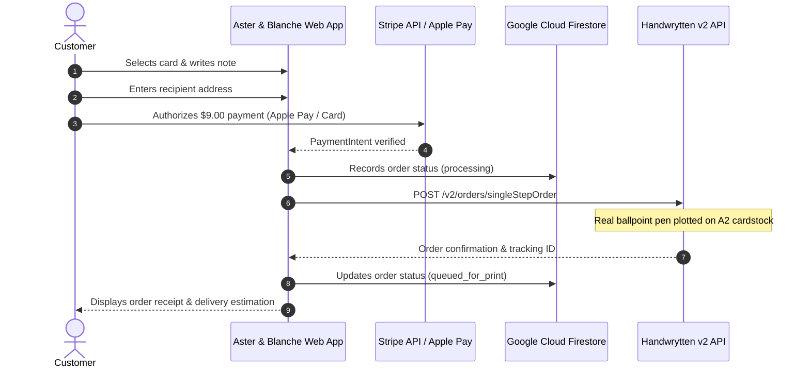

# Aster & Blanche (SendMyNotes)

> **Boutique letterpress atelier & real pen-written greeting cards sent in 60 seconds.**

[](https://nextjs.org/)
[](https://react.dev/)
[](https://www.typescriptlang.org/)
[](https://tailwindcss.com/)
[](https://stripe.com/)
[](https://www.handwrytten.com/)
[](https://firebase.google.com/)

---

## Overview

**Aster & Blanche** is a modern e-commerce web platform engineered to eliminate friction from thoughtful correspondence. Customers can select a fine-art card, compose or shuffle a heartfelt personal note, preview physical pen-on-paper coordinates in real time, and mail a custom greeting card in under 60 seconds with Apple Pay or credit card.

Behind the scenes, orders are fulfilled physically via real ballpoint ink pens on heavy 100 lb textured cardstock through the **Handwrytten API**, stamped, and dispatched via First-Class USPS mail.

---

## Key Features

* **1:1 Photorealistic Card Preview:** Real-time canvas simulation mirroring physical Handwrytten plotting coordinates, line breaks, margins, and paper textures.
* **Natural Note Composer:** Unified single-field authoring (salutation, sentiment, closing, signature) with an instant smart shuffle across 11 occasions and 4 distinct tones.
* **Curated Calligraphy:** Defaults to authentic adult handwriting scale (**Casual David / `hwDavid`** at ~4mm letter height and ~8.5mm line spacing).
* **Atelier Colophon Backplate:** Custom architectural heritage press mark (Aster & Blanche Press, Lake Forest, IL) rendered at 300 DPI (`public/aster-blanche-backplate.png`, Handwrytten ID `751314`).
* **Frictionless Checkout:** Flat $9.00 all-inclusive pricing (card + custom ink plotting + first-class postage) with native Apple Pay / Stripe Elements.
* **Zero-Spam Address Entry:** Clean inputs with standard HTML5 autofill (`shipping address-line1`, etc.) for 1-tap browser and Keychain autofill.

---

## Tech Stack

| Layer | Technologies |
| :--- | :--- |
| **Framework** | [Next.js 15](https://nextjs.org/) (App Router, Server Actions, Route Handlers) |
| **UI & Styling** | [React 19](https://react.dev/), [Tailwind CSS](https://tailwindcss.com/), [Lucide React](https://lucide.dev/) |
| **Payments** | [Stripe Elements](https://stripe.com/docs/elements) (Apple Pay, Google Pay, Credit Card) |
| **Fulfillment** | [Handwrytten API v2](https://www.handwrytten.com/api/) (`/v2/orders/singleStepOrder`) |
| **Database & Auth** | [Google Cloud Firestore](https://firebase.google.com/docs/firestore), Firebase Auth |
| **Image Pipeline** | [Sharp](https://sharp.pixelplumbing.com/) (300 DPI vector-to-raster cardstock generation) |
| **Hosting** | [Firebase App Hosting](https://firebase.google.com/docs/app-hosting) / Google Cloud Run |

---

## Security & Secrets Management

> **Industry Best Practice Notice:** Never commit secrets, private tokens, or live production keys to version control.

* All confidential keys (`STRIPE_SECRET_KEY`, `HANDWRYTTEN_API_KEY`, Firebase Admin credentials) remain strictly server-side.
* Only public identifiers (`NEXT_PUBLIC_STRIPE_PUBLISHABLE_KEY`, `NEXT_PUBLIC_APP_URL`) may be exposed to client bundles.
* In production, secrets are managed securely via **Google Cloud Secret Manager** and injected into Firebase App Hosting containers at runtime.

---

## Getting Started

### 1. Prerequisites
* **Node.js:** v20.x or higher
* **npm:** v10.x or higher
* Active accounts on **Stripe**, **Handwrytten**, and **Firebase**

### 2. Installation
```bash
git clone https://github.com/zbrustkern/sendmynotes.git
cd sendmynotes
npm install
```

### 3. Environment Configuration
Copy the template and configure your local development keys:
```bash
cp .env.example .env.local
```

Fill in your credentials in `.env.local`:
```env
# Stripe
STRIPE_SECRET_KEY=sk_test_...
STRIPE_WEBHOOK_SECRET=whsec_...
NEXT_PUBLIC_STRIPE_PUBLISHABLE_KEY=pk_test_...

# Handwrytten Fulfillment
HANDWRYTTEN_API_KEY=your_handwrytten_api_key
HANDWRYTTEN_TEST_MODE=true

# Firebase & App
FIREBASE_PROJECT_ID=your-project-id
NEXT_PUBLIC_APP_URL=http://localhost:3000
```

### 4. Running the Development Server
```bash
npm run dev
```
Open [http://localhost:3000](http://localhost:3000) in your browser.

---

## Available Scripts

| Command | Description |
| :--- | :--- |
| `npm run dev` | Starts the Next.js local development server with Hot Module Reloading |
| `npm run build` | Compiles the production build |
| `npm run start` | Boots the Next.js production server |
| `npm run lint` | Runs ESLint across the codebase |
| `npm run build:assets` | Compiles `assets/card-back.svg` into 300 DPI PNG backplate |
| `npm run build:previews` | Re-generates cover and card catalog thumbnail previews |
| `npm run test:m1` | Runs Milestone 1 integration tests |
| `npm run test:m4` | Runs Milestone 4 integration tests |

---

## Repository Structure

```
sendmynotes/
├── app/                  # Next.js App Router (pages, layout, route handlers)
│   ├── api/              # Fulfillment webhooks and Stripe endpoints
│   ├── checkout/         # Multi-step checkout & payment flows
│   └── page.tsx          # Storefront & card selection experience
├── assets/               # Master SVG vectors and design source assets
├── components/           # Reusable UI components
│   ├── AddressStep.tsx   # Native autofill recipient address form
│   ├── CardPreview.tsx   # 1:1 physical plotter preview simulation
│   └── InsideNoteStep.tsx# Single-field message composer & tone shuffle
├── context/              # React state providers (cart, session, flow)
├── lib/                  # Server-side clients & utilities
│   ├── firebase.ts       # Firestore & Admin SDK integration
│   ├── handwrytten.ts    # SingleStepOrder API client & font configs
│   └── stripe.ts         # Stripe payment intent helpers
├── public/               # Static web assets & 300 DPI print backplates
├── scripts/              # Asset compilers & image pipeline scripts
└── tests/                # Automated milestone & integration tests
```

---

## Order Fulfillment Flow



---

## License & Attribution

Copyright © Aster & Blanche Press / SendMyNotes. All rights reserved. Private repository.
