# Brand Identity & Value Proposition Clarification: The Strategic Separation of SendMyNotes and Aster & Blanche

**Document Classification:** Canonical Brand Doctrine & Strategic Directive  
**Target File:** `docs/BRAND_IDENTITY_AND_VALUE_PROPOSITION_CLARIFICATION.md`  
**Author:** Brand Strategy Lead  
**Scope:** Core Product Strategy, Consumer Psychology, Physical Artifact Architecture, and Domain Boundaries  

---

## Executive Summary: The Architecture of an Emotional Illusion

The core business of SendMyNotes and Aster & Blanche is not the retail sale of folded cardstock. It is the delivery of **the authentic social currency of personal effort, intimacy, and care**. 

The fundamental thesis of the business rests on a single psychological principle:
> **The Veneer of High Personal Effort:** When a recipient opens their physical mailbox, they must receive the unmistakable impression that the sender took the deliberate time to visit a boutique stationery shop, hand-selected an exquisite card, sat down with a ballpoint pen to compose a heartfelt note, penned the envelope with their own personal return address, affixed a genuine USPS First-Class stamp, and walked it to a collection box.

The value proposition is built upon an **asymmetric duality**:
1. **The Sender's Need (Private):** Absolute convenience. Modern senders desire to be thoughtful, but life imposes massive friction—driving to a store, browsing shelves, finding a working pen, overcoming writer's block, purchasing postage stamps, and locating a mailbox. Senders want to execute a genuine gesture in under 60 seconds from their phone.
2. **The Recipient's Need (Public):** High perceived effort. If the recipient suspects the card was generated by software, plotted by a robot, or dropshipped from a third-party fulfillment warehouse, the emotional value of the gesture collapses to zero.

The recent confusion within the engineering and product team—manifesting in proposals to merge the two brands and replace personal return addresses with a generic studio warehouse address—arose from viewing the platform through a **monolithic technical software pipeline** rather than **dual-audience consumer psychology**.

This document permanently resolves this confusion, formalizes the strategic boundary between **SendMyNotes** (the private convenience engine) and **Aster & Blanche** (the prestige stationery imprint), and establishes the non-negotiable operational rules governing the physical artifact.

---

## Part 1: Why the Confusion Between the Two Brand Concepts Arose

The confusion that prompted suggestions to merge Aster & Blanche into SendMyNotes and to substitute a generic studio return address was not accidental; it was the predictable result of viewing the product through the wrong mental model.

```mermaid
flowchart TD
    subgraph FlawedModel ["The Flawed Software Factory Mental Model (Monolithic)"]
        User["Single User (Sender)"] --> Input["Form Inputs"]
        Input --> Stripe["Stripe Checkout"]
        Stripe --> API["Fulfillment API (Handwrytten)"]
        API --> PhysicalCard["Physical Card Dropshipped"]
        PhysicalCard --> Error["Fatal Flaw: Treats recipient as passive delivery destination"]
    end

    subgraph CorrectModel ["The Asymmetric Dual-Audience Model (Psychological Reality)"]
        Sender["The Sender (Private Client)"] -->|Seeks 60-Second Speed & Guilt Relief| SMN["SendMyNotes.com<br/>(The Secret Convenience Engine)"]
        SMN -->|Dispatches Invisible Fulfillment| Envelope["Physical Envelope<br/>(THE EMOTIONAL BOUNDARY)"]
        Envelope -->|Presents Genuine Return Address & Stamp| Recipient["The Recipient (Emotional Consumer)"]
        Recipient -->|Inspects Quality & Colophon| AB["Aster & Blanche<br/>(Prestige Stationery Imprint)"]
        Recipient -->|Psychological Impression| Perception["Perception: Sender invested significant personal time & taste"]
    end
```



### 1.1 Technical / Software Factory Perspective vs. Consumer Psychology

In traditional e-commerce (e.g., buying a pair of shoes or an electronics accessory), the buyer and the consumer are the exact same person. The system can be modeled as a linear, single-party pipeline:
$$\text{User Traffic} \longrightarrow \text{SKU Selection} \longrightarrow \text{Payment Gateway} \longrightarrow \text{Warehouse Fulfillment} \longrightarrow \text{Package Delivery}$$

From an engineering and "software factory" perspective, optimizing this pipeline means eliminating friction: reduce form fields, standardize API payloads, minimize external dependencies, and centralize domain branding under a single unified banner.

However, **a personal greeting card is not a consumer commodity; it is a relational communication token.** There are two distinct parties involved whose psychological incentives and evaluative criteria are radically opposed:

| Dimension | The Sender (Buyer / Patron) | The Recipient (Evaluator / Loved One) |
| :--- | :--- | :--- |
| **Primary Incentive** | Speed, convenience, guilt relief, emotional connection without operational friction. | Validation of intimacy, proof of care, perception of personal time and effort invested. |
| **Time Preference** | Fast (wants the transaction finished in 60 seconds). | Slow (cherishes the belief that the sender spent 30–45 minutes on the gesture). |
| **Desired Technology** | High tech (Apple Pay, responsive mobile web, autofill). | Zero tech (archival paper, wet ballpoint ink, physical postal stamp). |
| **Point of Contact** | `sendmynotes.com` (web interface). | The physical mailbox (tangible artifact) and `asterandblanche.com` (verification). |

When engineers treat the project as a monolithic pipeline, they optimize for the Sender's logistics while ignoring the Recipient's emotional autopsy of the physical mailpiece. If an optimization for the Sender damages the Recipient's belief in the gesture, **it destroys the very product the Sender is paying for.**

---

### 1.2 Conflating the Sender's Utility with the Recipient's Perception

The fatal mistake in early positioning was treating **the sender's utility** (a 60-second digital tool) as if it were **the product's public brand identity**.

Consider the emotional contract of gift-giving:
* When a sender buys flowers from an upscale local florist, the florist delivers the bouquet in bespoke craft paper with a silk ribbon. The florist does *not* leave a sticker on the bouquet that says: *"Ordered in 12 seconds via QuickFlowers automated API dispatch."*
* When an executive hires an elite tailor or concierge, the final garment bears the imprint of the atelier, not the logistics software used to schedule the fitting.

The sender uses SendMyNotes precisely because it is fast. **But the sender specifically requires that the recipient never knows it was fast.** 

The entire emotional value of physical mail in the 21st century derives from the **deliberate inefficiency** of the medium. An email or a text message is instant and free; therefore, its social value is marginal. A physical handwritten card is valuable because society understands the high transaction costs required to produce it: traveling to a store, selecting stationery, finding a pen, drafting a note by hand, buying a stamp, and finding a mailbox.

When technical proposals suggested branding the service uniformly as "SendMyNotes"—or worse, surfacing language about "AI generation" and "robotic plotting"—they were branding the physical card with the sender's shortcut. Surfacing the shortcut turns a heartfelt gesture into an insult. The recipient feels cheated: *"You didn't write this; an automated internet service did."*

The sender is purchasing **the illusion of artisanal effort**. Exposing the utility shatters the illusion.

---

### 1.3 The Return Address Failure: The Anatomy of a Critical Misunderstanding

During sprint planning and form-optimization discussions, a proposal was made to eliminate the sender return address inputs from checkout and replace them with a static **"Studio Return Address" in Phoenix, Arizona** (the physical fulfillment facility of Handwrytten) or a generic "Aster & Blanche Press, Phoenix, AZ" label.

From an engineering perspective, the rationale seemed obvious:
* It removes 6 input fields from Step 3 (`sender_address1`, `sender_city`, `sender_state`, etc.).
* It reduces form fatigue on mobile devices.
* It streamlines the Handwrytten API payload.

**From a consumer psychology perspective, this proposal was a catastrophic error that would have rendered the product commercially non-viable.**

```mermaid
flowchart TD
    subgraph ProposalFailure ["The Proposed 'Studio Return Address' Catastrophe"]
        Mailbox1["Recipient opens mailbox in Atlanta, GA"] --> Envelope1["Examines Envelope"]
        Envelope1 --> ReturnCheck1{"Return Address:<br/>Aster & Blanche Studio<br/>Phoenix, AZ"}
        ReturnCheck1 --> CollapsedThought1["'My brother in Denver didn't send this.'"]
        CollapsedThought1 --> CollapsedThought2["'This is marketing spam, a dropshipped novelty, or a corporate proxy.'"]
        CollapsedThought2 --> Outcome1["Emotional gesture DESTROYED. Sender looks insincere."]
    end

    subgraph CorrectArchitecture ["The Mandatory Personal Return Address Standard"]
        Mailbox2["Recipient opens mailbox in Atlanta, GA"] --> Envelope2["Examines Envelope"]
        Envelope2 --> ReturnCheck2{"Return Address:<br/>John Doe<br/>123 Pine St, Denver, CO"}
        ReturnCheck2 --> ValidatedThought1["'John sent this to me from Denver.'"]
        ValidatedThought1 --> ValidatedThought2["'He sat down, penned the envelope, and mailed it.'"]
        ValidatedThought2 --> Outcome2["Intimate connection preserved. Product succeeds 100%."]
    end
```



The physical envelope is the first tactile and visual touchpoint of the experience:
1. **The Postal Autopsy:** Every person opening physical mail performs an immediate, subconscious 2-second audit:
   * *Who is this from?* (Glance at the top-left return address).
   * *Is it junk mail or official business?* (Glance at postage: printed permit barcode vs. real First-Class stamp).
   * *Is it personal?* (Glance at handwriting: machine printed label vs. real ink penmanship).
2. **The Geographic Mismatch:** If a mother in Ohio receives a birthday card from her daughter in Seattle, but the return address reads *"Aster & Blanche Press, 123 Commercial Pkwy, Phoenix, AZ"*, the illusion collapses immediately:
   * The mother knows her daughter does not live in Phoenix.
   * She instantly recognizes that a third-party commercial dropshipper produced the envelope.
   * The real-ink handwriting on the inside of the card is now re-evaluated: *"If she didn't address the envelope, she didn't write this note either. A machine wrote it."*
3. **The Loss of Intimacy:** The card is instantly downgraded from an intimate personal keepsake to a transactional novelty. The sender's social standing is diminished, and they will never use the service again.

The sender's personal return address is **not a logistical optionality; it is the physical credential of authenticity**. Sacrificing it to save 15 seconds in a checkout form destroys the entire reason the customer is willing to pay $9.00.

---

### 1.4 The Mistaken Merger Proposal: Why Subsuming Aster & Blanche Destroys Value

A related proposal suggested collapsing the architecture entirely: deprecate the Aster & Blanche identity, point all domains to `sendmynotes.com`, and brand the entire enterprise under SendMyNotes.

The argument for the merger was rooted in operational parsimony: *"Why support two brand identities, two domains, and dual marketing narratives for one small startup?"*

This proposal misunderstood the function of the **colophon**.

#### The Psychology of the Reverse Leaf
When a consumer receives a premium greeting card (e.g., Crane & Co., Papyrus, Rifle Paper Co., or Sugar Paper), what is the first thing they do after reading the note? **They turn the card over to look at the back.**

They are checking the pedigree of the paper:
* If the backplate displays a refined, blind-debossed letterpress mark reading:
  $$\textbf{ASTER \& BLANCHE PRESS}$$
  $$\textit{Fine Art Stationery Atelier — Lake Forest, Illinois}$$
  The recipient's impression is reinforced: *"This is a gorgeous, expensive boutique card. They spent \$8 to \$12 at a high-end paper goods shop."*
* If the recipient visits `asterandblanche.com`, they find a quiet, elegant digital storefront celebrating archival paper, fine typography, and timeless correspondence. The authenticity is confirmed.

#### The Consequence of a SendMyNotes Colophon
Now consider what happens if Aster & Blanche is subsumed into SendMyNotes:
* The recipient flips the card over and sees:
  $$\textbf{SENDMYNOTES.COM}$$
  $$\textit{Send real handwritten cards online in 60 seconds!}$$
* Or, curious about the paper, they visit `sendmynotes.com` on their mobile phone and land on a high-conversion digital funnel with Apple Pay buttons, occasion pickers, and promotional banners.
* **The entire secret is exposed.** The card screams: *"I was too busy to write you a letter, so I used an internet shortcut to have a robot do it for me."*

Attempting to merge the brands collapses the critical firewall between the **Prestige Stationery Imprint** and the **Convenience Engine**.

---

## Part 2: How the Difference Between the Two Brands is Fundamental to the Value Proposition

The relationship between Aster & Blanche and SendMyNotes is not a branding conflict to be resolved; it is a **deliberate, complementary brand architecture** that powers the business model.

```
+---------------------------------------------------------------------------------------+
|                                    SENDMYNOTES                                        |
|                          "The Secret Convenience Engine"                              |
|                                                                                       |
|   Target Audience:  The Thoughtful Sender (Private)                                   |
|   Digital Touch:    sendmynotes.com                                                   |
|   Brand Role:       Frictionless speed, 60-second creation, smart defaults, wallet    |
|   Physical Token:   COMPLETELY INVISIBLE (Zero branding on card, envelope, or paper)  |
+---------------------------------------------------------------------------------------+
                                           │
                                           │  Fulfills physical order via:
                                           ▼
+───────────────────────────────────────────────────────────────────────────────────────+
|                                 THE PHYSICAL ENVELOPE                                 |
|                             "The Sacred Emotional Boundary"                           |
|                                                                                       |
|   • Penned with the SENDER'S individual return address (Authenticity Credential)      |
|   • Addressed with genuine robotic ballpoint pen ink (Tactile Indentation)            |
|   • Affixed with an authentic USPS First-Class physical postage stamp                 |
+───────────────────────────────────────────────────────────────────────────────────────+
                                           │
                                           │  Delivered into the hands of:
                                           ▼
+---------------------------------------------------------------------------------------+
|                                  ASTER & BLANCHE                                      |
|                          "The Prestige Stationery Imprint"                            |
|                                                                                       |
|   Target Audience:  The Recipient & Fine Paper Connoisseur (Public)                   |
|   Digital Touch:    asterandblanche.com                                               |
|   Brand Role:       Validates luxury pedigree, fine art curation, archival cardstock  |
|   Physical Token:   Colophon mark on back leaf; bespoke artwork; letterpress heritage |
+---------------------------------------------------------------------------------------+
```

---

### 2.1 The Core Heart of the Principle: Costly Signaling and Emotional Valence

In evolutionary biology and behavioral economics, **Costly Signaling Theory** (Zahavi, 1975; Veblen, 1899) demonstrates that signals are only credible if they impose a meaningful cost on the sender that cannot be easily faked.

In personal correspondence:
* **Cheap Signals:** An automated calendar invite, a Facebook birthday post, a generic Slack message, or a group text message. Cost: \$0.00 and 3 seconds of effort. Value to recipient: Near zero.
* **Costly Signals:** A heavy cardstock note written in real ballpoint ink, enclosed in an envelope bearing the sender's own address, affixed with a First-Class stamp, and delivered via postal carrier. Perceived cost: High financial cost (\$8–\$12), substantial cognitive cost (authoring a personal sentiment), and high friction (purchasing, stamping, mailing). Value to recipient: Immense emotional resonance.

The entire commercial viability of this enterprise relies on **delivering the social benefit of a costly signal while reducing the sender's actual cost to 60 seconds and $9.00**.

If the recipient discovers that the cost was low, the signal's value evaporates. Therefore, **every physical and digital touchpoint must preserve the credibility of the signal.**

The recipient must believe:
1. The sender went to an upscale stationery atelier.
2. The sender selected an exquisite, tasteful card.
3. The sender sat down with a ballpoint pen and handwrote their message.
4. The sender hand-addressed the envelope with their own return address.
5. The sender affixed a stamp and walked it to the mailbox.

---

### 2.2 Aster & Blanche as the Prestige Stationery Imprint

Aster & Blanche (`asterandblanche.com`) is the public-facing guardian of the product's pedigree. Its strategic functions are distinct:

1. **The Stationery Backplate Colophon:**
   The reverse leaf of every card produced carries the refined mark of *Aster & Blanche Press*. It anchors the card in the physical world of luxury printmaking. It looks like a card purchased from a high-end boutique in Lake Forest, Soho, or Mayfair.
2. **Recipient Validation:**
   If a recipient inspects the physical card and visits `asterandblanche.com`, they must encounter a tranquil, elegant stationery house:
   * Visuals of textured 120 lb archival paper and blind-embossed debossing.
   * Curated fine art collections, letterpress craftsmanship, and literary sentiment.
   * Zero references to "instant APIs," "webhooks," "robotic plotters," or "dropshipping."
3. **Protecting the Sender's Taste:**
   The Aster & Blanche brand reflects prestige onto the sender. It tells the recipient: *"The person who sent this has impeccable taste and values traditional craft."*

---

### 2.3 SendMyNotes as the Secret Convenience Engine

SendMyNotes (`sendmynotes.com`) is the private transactional engine. It exists exclusively for the sender:

1. **The 60-Second Promise:**
   SendMyNotes removes the 5 deadly friction points of physical correspondence:
   * *No shopping:* Curated, ready-made cards front and center across all occasions.
   * *No handwriting cramps or bad penmanship:* Genuine robotic pens in real ballpoint ink replicate human cursive with authentic paper indentation.
   * *No writer's block:* Curated, intelligent sentiments and effortless editing.
   * *No stamp hunting:* First-Class postage included and physically affixed.
   * *No mailbox hunting:* Directly injected into the USPS mail stream.
2. **Impulse-First Commerce:**
   SendMyNotes operates with zero mandatory account creation, frictionless Apple Pay and Google Pay integration, and seamless single-page progression.
3. **The Invisible Partner (The Modern Cyrano de Bergerac):**
   SendMyNotes acts as the sender's trusted private concierge. Like Cyrano de Bergerac whispering poetry from the shadows, SendMyNotes provides the words, the craft, and the delivery—while allowing the sender to receive 100% of the emotional credit.

---

### 2.4 The Envelope as the Emotional Boundary

The physical envelope is the **firewall** separating SendMyNotes from the recipient's consciousness. For this firewall to hold, three physical rules are non-negotiable:

1. **The Personal Return Address is Mandatory:**
   The envelope must display the sender's individual return address in the top-left corner. It must never feature a fulfillment center, an industrial park in Phoenix, or a third-party corporate name. 
2. **Genuine First-Class Postage Stamps Only:**
   The envelope must feature a real, physical USPS First-Class adhesive postage stamp. Metered mail barcodes, commercial presort permits, or inkjet postage indicia immediately flag the envelope as commercial junk mail or automated billing. A physical stamp signals personal correspondence.
3. **Authentic Ballpoint Pen Envelope Inking:**
   Both the recipient address and the return address must be plotted using real ballpoint pens that physically bite into the paper fibers, matching the ink quality of the note inside.

#### Resolving the Checkout UX Friction Without Sacrificing the Envelope
The engineering team's concern regarding form fatigue was valid: asking users for 12 manual address fields on a mobile screen causes abandonment. 

However, the solution is **not to delete the return address**; the solution is **to eliminate the cognitive friction of entering it**:
* **Transparent Psychological Framing:** Clearly explain to the sender *why* the address is required:
  > *"Penned in the top-left corner so your recipient knows this card came personally from you."*
  When senders understand that their return address protects the magic of the gift, they provide it willingly.
* **Intelligent Prefilling:** Automatically prefill the sender's First and Last Name from the sign-off closing of their note in Step 2 (e.g., *"Warmly, Sarah Jenkins"* $\rightarrow$ prefill `First Name: Sarah`, `Last Name: Jenkins`).
* **HTML5 Autofill & Keychain:** Utilize strict standard HTML5 autocomplete tags (`billing address-line1`, `postal-code`) enabling 1-tap browser and Keychain population.
* **Persistent Profiles:** For returning senders, cache their verified return address so subsequent sends require zero keystrokes.

---

## Part 3: Strategic Brand Architecture Matrix & Operational Directives

To prevent future regression, this matrix defines the operational, visual, and architectural boundaries between the two brands:

| Strategic Dimension | Aster & Blanche (`asterandblanche.com`) | SendMyNotes (`sendmynotes.com`) |
| :--- | :--- | :--- |
| **Brand Role** | The Prestige Stationery Imprint | The Secret Convenience Engine |
| **Primary Audience** | The Recipient (and Fine Paper Enthusiasts) | The Thoughtful Sender |
| **Psychological Focus** | Emotional validation, craft, archival quality, permanence | Speed, ease, guilt relief, 60-second completion |
| **Visual Aesthetic** | Archival cream (`#FAF8F5`), editorial typography, quiet luxury | Modern, crisp, tactile preview, frictionless wallet |
| **Public Messaging** | *"Fine Art Stationery Atelier — Bespoke Correspondence"* | *"Send a genuine handwritten card in 60 seconds from your phone"* |
| **Presence on Physical Card** | **Prominent:** Exclusive backplate colophon mark (`751314`) | **STRICTLY FORBIDDEN:** Zero presence on any physical leaf |
| **Presence on Envelope** | **None:** Card press imprint does not brand the envelope | **None:** Sender's personal address appears exclusively |
| **Checkout & Payments** | Showcase catalog; redirects custom sending to engine | Full linear checkout (Stripe Elements, Apple Pay, Google Pay) |

---

### The Four Inviolable Laws of the Brand Architecture

Any code change, API modification, or design iteration must strictly abide by these four laws:

1. **The Zero-Colophon Rule (The Brand Firewall):**
   `sendmynotes.com`, "SendMyNotes", or any reference to automated software dispatch must **NEVER** appear on any physical card, backplate, envelope, or package insert. The physical stationery belongs 100% to Aster & Blanche Press and the individual sender.
2. **The Personal Credential Rule (Mandatory Return Address):**
   Every order dispatched through the Handwrytten API or any future fulfillment partner must carry the sender's verified personal return address. Falling back to a studio warehouse address (e.g., Phoenix, AZ) is classified as a critical system defect (`P0`), because it exposes the third-party nature of the shipment.
3. **The Recipient Verification Rule:**
   `asterandblanche.com` must always resolve to an exquisite, quiet boutique stationery storefront. A recipient inspecting the website must never see marketing copy referencing "API dropshipping," "instant robot card sending," or "automated vending machines."
4. **The Physical Authenticity Rule:**
   All correspondence must maintain physical fidelity: genuine ballpoint pens that physically indent archival cardstock, matched envelopes, and real USPS First-Class postage stamps. Metered postal barcodes and inkjet envelope printing are strictly prohibited.

---

## Conclusion: The Power of Harmonious Duality

SendMyNotes and Aster & Blanche are not competing concepts or redundant brands. They are **two halves of a single, brilliant commercial engine**.

* Without **SendMyNotes**, Aster & Blanche is just another beautiful, low-volume stationery press stranded in an analog world of high-friction retail.
* Without **Aster & Blanche**, SendMyNotes is just an uninspiring, impersonal transactional utility that strips the soul and emotional value out of greeting cards.

Together, they execute a modern miracle of consumer psychology: **allowing a sender to express genuine love, gratitude, or sympathy in 60 seconds from the palm of their hand—while delivering to the recipient a timeless, tactile artifact of undeniable personal effort.**

By preserving the strict boundary between the private tool and the public artifact, we protect the emotional magic of the product and guarantee its long-term commercial success.
