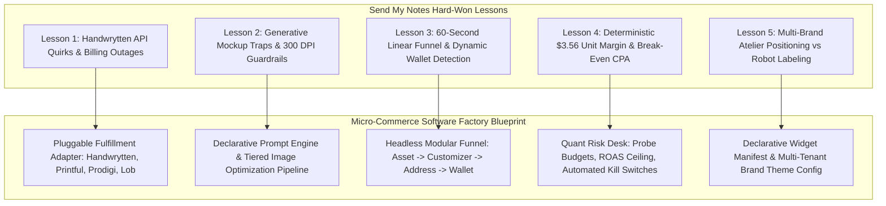

# SENDMYNOTES_HISTORICAL_CONTEXT_AND_LESSONS_LEARNED.md
**Project Codename:** Send My Notes / Aster & Blanche Press  
**Domain:** Boutique Letterpress Atelier & Physical Robotic Handwriting E-Commerce  
**Document Type:** Exhaustive Historical Context, Real-World Edge Cases & Architecture Blueprint  
**Target Consumer:** Micro-Commerce Software Factory Core Architecture & Engineering Team  

---

## 1. Executive Origin & Evolution

### 1.1 The Genesis Thesis: "The 60-Second Physical Vending Machine"
The project originated under the domain **SendMyNotes.com** with a radical e-commerce hypothesis: *personal, physical correspondence has died not because people lack thoughtfulness, but because modern physical card sending imposes unacceptable friction.* Buying physical stationery, finding a working pen, drafting a note, locating a postage stamp, and walking to a USPS mailbox requires 4 to 5 discrete physical steps and days of delayed intent.

Send My Notes was conceived as an **"Internet Vending Machine"**:
* A customer enters with a brief intention (e.g., "Grandma's 85th birthday" or "Thanking a mentor").
* Generative AI paints bespoke vertical 5:7 cover art on demand.
* The customer types or shuffles a sincere personal message.
* Physical robots in an automated facility physically ink the message onto heavy cardstock using genuine ballpoint pens.
* The envelope is stamped and injected directly into the USPS First-Class mail stream.
* **Frictionless Conversion Constraint:** Exactly 60 seconds from landing to checkout; flat $9.00 all-inclusive pricing; zero mandatory customer account creation; instant 1-tap mobile payment (Apple Pay / Google Pay).

### 1.2 The Brand Evolution: From "AI Card Generator" to "Aster & Blanche Press"
During initial consumer testing and ad creative evaluation, a critical behavioral insight emerged: **Customers do not want to send a "robot card" or an "AI card."** When messaging emphasized "AI generation" and "robotic pen plotters," recipients perceived the gesture as synthetic, automated, and insincere. 

The brand underwent a complete transformation into **Aster & Blanche Press** (Lake Forest, IL):
1. **The Colophon & Atelier Heritage:** The card was anchored in traditional letterpress stationery cues—warm archival cardstock textures (`#FAF8F5`, `#FDFCF7`), a blind-debossed inset border rule, and an authentic heritage colophon backplate on the reverse leaf.
2. **Linguistic De-Automation:** References to "robot arms," "AI models," and "prompt engineering" were stripped from the storefront. In their place: *"Archival ballpoint ink,"* *"120 lb textured cardstock,"* *"Aster & Blanche Bespoke Atelier,"* and *"1-of-1 studio original painting."*
3. **Preserving Intentionality:** Generative AI was repositioned from a novelty gimmick into a bespoke atelier artist that creates custom 1-of-1 art for the sender's recipient.

### 1.3 The Impulse-First Headless Funnel
Traditional e-commerce platforms (Shopify, WooCommerce) rely on a catalog-browse-cart-checkout model requiring 6 to 10 page navigations and intrusive account forms. Send My Notes demonstrated that single-item micro-commerce requires an **unbroken, single-page progressive disclosure funnel**:
* **Step 1: Front Cover Art (Visual Hook)** — Choose curated atelier art or generate via prompt.
* **Step 2: Inside Note (Emotional Anchor)** — Select real-pen handwriting style (`hwDavid`, `hwKate`, etc.) and type or shuffle curated message pairings.
* **Step 3: Mailing Address (Physical Logistics)** — Recipient and return address with HTML5 browser/Keychain autofill. Optional 1-click annual occasion reminder.
* **Step 4: Frictionless Checkout (Monetization)** — Dynamic device wallet detection (Apple Pay / Google Pay) or Stripe Elements with instant order confirmation.

---

## 2. Architectural Milestones & Key Commits

The Git commit history reveals a meticulous, chronological path from initial proof-of-concept to a hardened commercial engine.

| Commit Hash | Date | Milestone Category | Architectural Significance & Real-World Impact |
| :--- | :--- | :--- | :--- |
| `62bd469` | 2026-09-22 | Genesis | Repository initialization. |
| `d8f2890` | 2026-09-22 | Core Architecture | Complete initial build of sendmynotes.com internet vending machine. Next.js App Router, Stripe Elements, Handwrytten client, Firebase. |
| `a4480c3` | 2026-09-22 | Cloud Infrastructure | Firebase App Hosting deployment setup, Google Cloud Secret Manager bindings, Google Imagen 3 API integration. |
| `2d82a55` | 2026-09-22 | Visual Fidelity | Aligned card preview to authentic 5×7 book-fold with 10×7 two-page spread canvas simulation. |
| `3782ba3` | 2026-09-22 | Economics & Ops | Enforced $9.00 flat rate pricing, built initial operator admin portal, funnel telemetry, and IP rate limiting. |
| `50a27f0` | 2026-09-23 | Checkout Hardening | Added Stripe Publishable Key runtime delivery, added `onReady`/`onLoadError` handlers to `PaymentElement` to prevent loading race conditions. |
| `86904f1` | 2026-09-23 | Security | Moved secrets from client exposure to Google Secret Manager runtime injection. Removed hardcoded keys. |
| `f69a87a` | 2026-09-23 | Fulfillment Engine | Standardized Handwrytten API v2 fulfillment, added focus preview switcher, transitioned copy to real ink and heavy cardstock. |
| `ce34d8c` | 2026-09-23 | Retention Engine | Added customer account model, saved address book, scheduled send dates, and admin route protection. |
| `aa999f7` | 2026-09-23 | Generative Art | Real-time AI art generation engine with visual preview and step synchronization. |
| `2ccd382` | 2026-09-23 | Stationery Polish | Added prompt inspiration chips, dynamic USPS delivery window estimation, and mobile bottom-sheet preview drawer. |
| `bb3b409` | 2026-09-23 | Calligraphy Parity | Embedded authentic Handwrytten robotic pen TTF fonts and refined printed sentiment typography. |
| `6c457d0` | 2026-09-23 | Atelier Branding | Integrated Aster & Blanche Press backplate colophon and interior printed header with Handwrytten API. |
| `bbc320b` | 2026-09-23 | Print Aesthetics | Refined Aster & Blanche Press colophon by removing lower two text lines to maintain minimal high-end typography. |
| `c87f99d` | 2026-09-23 | Paper Spread Design | Formally reserved press imprint exclusively for the card back, keeping inside left leaf pristine and unprinted. |
| `0376a18` | 2026-09-23 | Editorial & Discovery | Added editorial micro-hero and implemented agentic discovery via `public/llms.txt` and Schema.org structured data. |
| `29cb267` | 2026-09-23 | Conversational UX | Boutique message browser with curated paired sentiments across 4 tones and external AI agent URL prefill parameters. |
| `ae23889` | 2026-09-23 | Typography Fix | Migrated handwriting font loading to `next/font/local` to eliminate layout shift and assigned distinct personality fallbacks. |
| `5467981` | 2026-09-23 | Plotter Alignment | Positioned pre-printed greeting in upper third and anchored handwriting to authentic physical baseline. |
| `2bb7d8b` | 2026-09-24 | GenAI Payload | Fixed Google Imagen API payload structure, added fallback chain, and displayed provider diagnostics. |
| `bd1c38b` | 2026-09-24 | Quality Control | Completely purged Pollinations fallback due to low-fidelity artifacts; surfaced explicit Google Imagen diagnostics. |
| `9fbf5c5` | 2026-09-24 | GenAI Architecture | Migrated image generation to Google GenAI Interactions API and `gemini-3.1-flash-image` with universal image extractor. |
| `e16458e` | 2026-09-24 | Webhooks & Sync | Added Handwrytten inbound webhook receiver (`/api/webhooks/handwrytten`) and live status sync in admin portal. |
| `d9abe94` | 2026-09-24 | Observability | Built operator incident feed (`system_incidents`), email alert subscriptions, and graceful checkout error handling. |
| `5256478` | 2026-09-24 | CSS Architecture | Unified card preview scaling using CSS Container Queries (`cqw` units) across focus and panoramic spread views. |
| `6aa5c91` | 2026-09-24 | Data Pipelines | Supported base64 data URIs in Handwrytten image uploader; added automated incident logging to Stripe webhook. |
| `8eab953` | 2026-09-24 | Legal Compliance | Published dedicated Privacy Policy satisfying Stripe merchant requirements with sole proprietorship liability terms. |
| `40b5f89` | 2026-09-24 | Discount Engine | Complete promotional code system: fixed/percentage discounts, VIP 100% free vouchers, and shareable links (`?discount=CODE`). |
| `99eb259` | 2026-09-24 | Apple Pay Verification | Hosted Apple Pay Merchant Domain Association route (`.well-known/apple-developer-merchantid-domain-association`). |
| `28400c5` | 2026-09-24 | Programmatic SEO | Launched dynamic scenario engine (`/send/[occasion]/[slug]`) with Schema.org markup and telemetry tracking. |
| `3d78e12` | 2026-09-24 | Organic Discovery | Dynamic `sitemap.xml` and `robots.txt` indexing all programmatic SEO scenarios. |
| `17ea65b` | 2026-09-24 | Payment Reliability | Added client-side payment confirmation fallback (`/api/checkout/confirm-order`) to eliminate webhook dropouts. |
| `6226cc9` | 2026-09-24 | Security & Persistence | Disk-persistent store fallback (`.data/mock-firestore.json`), high-entropy order IDs, zero-trust PII masking, and ADC Firestore support. |
| `ffa7045` | 2026-09-24 | Telemetry Scalability | Scalable atomic metrics rollup engine: O(1) reads for admin dashboards via aggregated summary document. |
| `a151429` | 2026-09-24 | Brute-Force Defense | Admin lockout engine: max 5 failed attempts triggers a mandatory 15-minute cooldown. |
| `73a26b7` | 2026-09-24 | Data Storage Guard | Sharp tiered compression pipeline guarding Firestore against the strict 1,048,487-byte document limit. |
| `e2eb442` | 2026-09-24 | Print Resolution | Upgraded artwork processing to 300 DPI (1500×2100 px) with 4:4:4 chroma subsampling for commercial print fidelity. |
| `4b48be0` | 2026-09-25 | Wallet Optimization | Dynamic device wallet detection (Apple Pay vs Google Pay vs Instant Checkout) and impulse-first messaging. |
| `90a973e` | 2026-09-25 | Attribution | Installed Google tag `AW-18474411963` with deduplicated purchase conversion tracking. |
| `a7a2d95` | 2026-09-25 | Enhanced Conversions | Added Google Ads Enhanced Conversions via SHA-256 / user_data email injection. |
| `1979a3f` | 2026-09-25 | Fulfillment Bugfix | Fixed Handwrytten backplate (`back_type: "logo"` with `back_logo_id`) and unified message into real-pen ink to resolve Arial header clipping. |
| `89f4ccb` | 2026-09-25 | Typography & Cohorts | Scaled backplate down 30%, defaulted font to Casual David, built A/B font cohort system. |
| `2ed4736` | 2026-09-25 | Brand Voice | Unified handwritten note authoring, purged robot phrasing, added instant note shuffle. |
| `bc01ec1` | 2026-09-25 | Firestore Reliability | Recursively stripped `undefined` properties and configured `ignoreUndefinedProperties: true` on Firestore instance. |
| `c280f99` | 2026-09-25 | Operator Cockpit | Added Handwrytten live balance widget, proof inspector modal, address retry tool, comp card generator, and cohort analytics. |
| `8622b59` | 2026-09-25 | Incident Classification | Smart error categorization (`STUDIO_BILLING` vs `OPERATOR_ACTION` vs `TRANSIENT`) and auto-resolution. |
| `c9d5bf6` | 2026-09-25 | Original IP Art | Replaced stock imagery with bespoke studio-owned 5×7 original card artwork. |
| `1a0ed26` | 2026-09-25 | Performance Max | Generated high-resolution Google Ads creative assets (1.91:1, 1:1, 4:5 ratios). |
| `4c4eb16` | 2026-09-25 | Quant Unit Economics | Built unit economics margins dashboard, ad spend simulator, and UTM attribution tracking engine. |
| `24fa187` | 2026-09-25 | Business Valuation | Interactive LTV, CAC payback, and SDE valuation heuristic modeling suite. |
| `f2651ab` | 2026-09-25 | Retention Flywheel | Annual milestone dates, opt-in occasion reminders, and post-checkout address book uplift. |
| `9bf6cd7` | 2026-09-25 | Contact Ingestion | Multi-format contact list parser supporting CSV, TSV (spreadsheet paste), and Apple/Google vCard (`.vcf`). |
| `63bdd84` | 2026-09-25 | Occasion Intent | Occasion-tailored post-purchase nudges preserving brand grace (birthday annual reminder vs sympathy quiet check-in). |
| `e0e245a` | 2026-09-25 | Thematic Pairing | Clickable 5×7 zoom lightbox and thematic front-to-inside pun pairings (e.g. dinosaur -> "DINO-MITE"). |
| `1490e77` | 2026-09-30 | Live Sync Fix | Migrated order polling to Handwrytten `/v2/orders/details` endpoint. |

---

## 3. Hard-Won Lessons & Real-World Edge Cases

### 3.1 Robotic Fulfillment & Handwrytten API

#### A. The "Arial Printed Header Clipping" Catastrophe & The Unified Ink Solution
* **The Failure Mode:** The Handwrytten API v2 `singleStepOrder` endpoint accepts two text fields: `header_text` (pre-printed in static ink) and `message` (plotted by the mechanical pen). In production testing, `header_text` proved to be disastrous. It was rendered in a generic 14pt Arial typeface strictly constrained to a 0.75-inch horizontal box at the top of the right leaf. Any sentiment longer than ~35 characters was abruptly clipped or line-wrapped awkwardly across the top edge. Furthermore, having mechanical Arial typography above fluid cursive ink shattered the aesthetic illusion of a handcrafted card.
* **The Architectural Fix (`lib/handwrytten.ts`):** We completely abandoned `header_text`. Instead, we concatenated the optional printed sentiment hook with the handwritten note into a single unified `message` payload separated by a double line-break:
  ```typescript
  const fullMessage = params.printedGreeting?.trim()
    ? `${params.printedGreeting.trim()}\n\n${params.handwrittenMessage.trim()}`
    : params.handwrittenMessage.trim();
  ```
  This routed the entire card interior to the robotic plotter. The robotic pen writes the greeting headline and the body note in genuine ballpoint ink, eliminating clipping and creating total typographic cohesion.

#### B. Font Scaling, Typography & The Container Query (`cqw`) Breakthrough
* **The Failure Mode:** Early card preview implementations used static pixel (`px`) or rem sizing for the preview text. While looking acceptable on desktop, on mobile devices (or inside the split two-column layout), the line breaks on screen did not match the physical Handwrytten robot's line breaks. Customers previewed a 4-line note that printed physically as 7 lines, overflowing the physical 4.25" × 5.5" leaf margins.
* **The Font Engine (`lib/fonts.ts` & `public/fonts/`):** We extracted and embedded the authentic TTF vector font files used by Handwrytten's plotting machines:
  * `hwDavid.ttf` (Casual David — adult ballpoint cursive, ~4mm letter height, ~8.5mm line spacing; set as default).
  * `hwKate.ttf` (Carefree Kate — expressive script).
  * `hwAdam.ttf` (Executive Adam — structured block/script hybrid).
  * `hwChase.ttf` (Charming Chase — flourished calligraphy).
  * `hwWill.ttf` (Dapper Will — upright cursive).
* **CSS Container Query Scaling (`components/CardPreview.tsx`):**
  We isolated the right card leaf in a container query context: `containerType: "inline-size"`. All padding, borders, line heights, and font sizes are defined strictly in Container Query Width units (`cqw`):
  ```css
  /* Physical A2 Book-Fold Proportions */
  inset: 3.5cqw;                 /* Letterpress deboss border */
  padding-top: 16cqw;            /* Head margin */
  padding-left: 9.5cqw;          /* Left spine gutter margin */
  padding-right: 9.5cqw;         /* Outer cut margin */
  font-size: 5.1cqw;             /* 1:1 mathematical font scale */
  line-height: 1.62;             /* Plotter pen carriage return pitch */
  ```
  Whether displayed on an iPhone screen (340px width), a desktop column (560px), or a modal spread (800px), the font and line wrapping remain mathematically identical to the physical paper.

#### C. Wholesale Billing Depletion & Smart Incident Classification
* **The Failure Mode:** Handwrytten does not bill an invoice at the end of the month by default; it charges a credit card on file or deducts from prepaid account credits ($3.50 base card + $1.38 USPS stamp = $4.88 wholesale COGS). If the operator's credit card on file expires or prepaid credits deplete below $4.88, Handwrytten rejects the `singleStepOrder` call with a cryptic JSON error (`"Insufficient balance"` or `"Payment failed"`).
* **The Triage Engine (`lib/order-processor.ts` & `lib/incident-logger.ts`):**
  Orders that fail fulfillment are immediately caught and categorized to prevent customer friction:
  ```typescript
  const isBillingError = /payment|card|balance|credit|funds/i.test(rawError);
  const isAddressError = /address|zip|postal|city|state|street/i.test(rawError);

  const category = isBillingError
    ? "STUDIO_BILLING"
    : isAddressError
    ? "OPERATOR_ACTION"
    : "TRANSIENT";
  ```
  * `STUDIO_BILLING`: Fires a critical alert email to the operator via Postmark/SendGrid (`lib/email-alerts.ts`), tags the incident with `severity: "error"`, and pauses retries until funds are restored.
  * `OPERATOR_ACTION`: Flagged when recipient address validation fails. The admin portal surfaces the `AddressRetryModal.tsx` allowing the operator to correct the postal address and re-dispatch with one click.
  * **Auto-Resolution:** When an operator resolves the root cause and successfully re-dispatches an order, `resolveIncidentsForOrder` automatically scans Firestore and marks all matching incident tickets as resolved (`resolved: true`).

#### D. The Backplate Colophon Contract
* **The API Trap:** Handwrytten's API documentation states that custom backplates can be passed via `back_id`. However, in practice, passing `back_id` without specifying `back_type: "logo"` causes the API to silently ignore the backplate or fail card creation.
* **The Implementation:** We created `getOrCreateBackplateImageId(apiKey)` in `lib/handwrytten.ts`. It verifies whether the 300 DPI master colophon (`public/aster-blanche-backplate.png`) has been uploaded. If not, it uploads the PNG via `/v2/cards/uploadCustomLogo`, caches the returned image ID in Firestore (`system_config/handwrytten`), and passes:
  ```json
  {
    "dimension_id": 4,
    "back_type": "logo",
    "back_logo_id": 751314,
    "cover_id": coverId
  }
  ```

---

### 3.2 Generative AI & Image Pipeline

#### A. The "Mockup Trap" & Anti-Mockup Prompt Sanitization
* **The Failure Mode:** Diffusion models (DALL-E 3, Midjourney, Google Imagen) are heavily trained on web imagery tagged with the word *"greeting card"*. When a user prompts: *"A vintage watercolor rose greeting card cover"*, the AI almost invariably generates a **photograph OF a card** lying on a wooden kitchen table, accompanied by coffee cups, scissors, paper clips, drop shadows, and hands holding the card. Printing a picture OF a card onto actual cardstock resulted in an absurd, unprintable physical product.
* **The Prompt Sanitizer (`sanitizeArtPrompt` in `lib/nano-banana.ts`):**
  Strips all meta-stationery terminology before dispatching to the model:
  ```typescript
  export function sanitizeArtPrompt(rawPrompt: string): string {
    return rawPrompt
      .replace(/\b(5:7\s+)?greeting\s+cards?(\s+cover)?(\s+art|\s+design|\s+portrait)?\b/gi, "")
      .replace(/\b(card\s+cover|card\s+art|card\s+design|card\s+mockup|stationery\s+set)\b/gi, "")
      .replace(/\b(deckled[- ]edge\s+paper|paper\s+mockup)\b/gi, "")
      .trim();
  }
  ```
* **The "CRITICAL MANDATE" Refined Prompt:**
  ```typescript
  export function buildRefinedPrompt(rawPrompt: string, occasion: string): string {
    const sanitized = sanitizeArtPrompt(rawPrompt);
    return [
      `Full-bleed vertical 5:7 portrait artwork: ${sanitized}.`,
      `Thematic inspiration: ${occasion}.`,
      `Style & Format: Pure 2D flat edge-to-edge illustration filling 100% of the canvas with zero borders, zero margins, and zero frames. High resolution fine art painting, vibrant color palette.`,
      `CRITICAL MANDATE: Output ONLY the standalone graphic illustration itself to be printed onto paper. Do NOT render an image OF a card. Do NOT render a greeting card mockup, photo of a card, paper edges, deckled paper, card borders, drop shadows, or envelopes. Do NOT render any human hands, fingers, or person holding the artwork. Do NOT render a table, desk, or background setting behind the card. The illustration must extend completely to every corner and edge of the image canvas.`
    ].join(" ");
  }
  ```
* **Explicit Negative Prompting:**
  ```typescript
  const ANTI_MOCKUP_NEGATIVE_PROMPT = 
    "hands, fingers, person holding, holding card, physical greeting card, card mockup, photo of a card, paper borders, white border, margins, deckled edges, drop shadow, tabletop, wood desk, envelope, background setting, 3D mockup, stationery set, card template";
  ```

#### B. The GenAI API Landscape: Interactions API vs. generateContent
* **The Evolution:** Early builds used raw `generateContent` or third-party wrappers like Pollinations. Pollinations suffered from unpredictable rate limits, 502 Bad Gateways, and extreme variability in aesthetic quality. It was permanently excised in commit `bd1c38b`.
* **Interactions API Architecture:** We standardized on Google's GenAI Interactions API (`generativelanguage.googleapis.com/v1beta/interactions`) using `gemini-3.1-flash-image` and `gemini-2.5-flash-image`.
* **The Universal Extractor (`extractImageDataUrl`):** Google GenAI SDKs return image bytes in drastically different response structures depending on API version. To avoid brittle parsing, we engineered a universal extractor that traverses:
  1. Direct `output_image.data` (modern Interactions API).
  2. `steps[].content[].image_content.data` (multi-step Interactions API).
  3. `outputs[].data` (batch Interactions API).
  4. `candidates[].content.parts[].inlineData.data` (standard Gemini multimodal).
  5. `predictions[].bytesBase64Encoded` (Vertex AI legacy Imagen predict).

#### C. Commercial Print Fidelity (300 DPI) vs. Cloud Firestore 1MB Limit
* **The Conflict:** Physical commercial printing on 5" × 7" cardstock requires **300 DPI (1500 × 2100 pixels)** to prevent fuzzy edges, pixelation, and washed-out watercolor washes. Furthermore, standard 4:2:0 chroma subsampling introduces severe compression artifacts on fine typography and line art. However, storing a high-entropy 300 DPI image as a base64 string directly in Cloud Firestore threatens Google Cloud's hard **1,048,487-byte (1MB) per document limit**. Base64 encoding inflates raw binary data by **33.3%**. An uncompressed 800KB JPEG produces a 1.07MB base64 string, which crashes Firestore writes immediately.
* **The Sharp Compression Guard (`lib/image-optimizer.ts`):**
  We engineered an automated tiered compression pipeline:
  ```typescript
  // Tier 1: Target commercial print fidelity at 300 DPI with 4:4:4 chroma subsampling
  let optimizedBuffer = await sharp(buffer)
    .resize(1500, 2100, { fit: "cover", position: "center" })
    .jpeg({ quality: 88, mozjpeg: true, chromaSubsampling: "4:4:4" })
    .toBuffer();

  // Tier 2: Failsafe guard if high-entropy image exceeds 600KB buffer (800KB base64)
  if (optimizedBuffer.length > 600 * 1024) {
    optimizedBuffer = await sharp(buffer)
      .resize(1250, 1750, { fit: "cover", position: "center" })
      .jpeg({ quality: 84, mozjpeg: true, chromaSubsampling: "4:4:4" })
      .toBuffer();
  }

  // Tier 3: Absolute guard against 1MB Firestore ceiling
  if (optimizedBuffer.length > 700 * 1024) {
    optimizedBuffer = await sharp(buffer)
      .resize(1050, 1470, { fit: "cover", position: "center" })
      .jpeg({ quality: 78 })
      .toBuffer();
  }
  ```
  This guarantees that every image sent to Handwrytten possesses crisp commercial print quality, while inline base64 data URLs average 90KB–140KB (under 15% of Firestore's document limit).

---

### 3.3 Payments, Checkout & Data Resilience

#### A. Dynamic Device Wallet Detection (`lib/device-wallet.ts`)
* **The Friction Problem:** Traditional checkout buttons say "Checkout" or "Place Order." For mobile users on Safari (iOS) or Chrome (Android), asking for a credit card number, expiration date, and CVV induces a 40%+ drop-off.
* **The Solution:** A client-side capability detector checks browser user-agent and platform capabilities:
  * Safari on iOS/macOS -> Detects Apple Pay capability -> Customizes copy: *"Pay with Apple Pay — $9.00"* and displays *"Mailed in 1-Tap with Apple Pay."*
  * Chrome/Android -> Detects Google Pay -> Displays *"Pay with Google Pay — $9.00."*
  * Desktop/Windows -> Displays *"Instant Checkout — $9.00 Flat."*
  * Matches consumer expectations before they even reach the payment step, driving impulse conversion.

#### B. The Firestore `ignoreUndefinedProperties` Runtime Trap
* **The Failure Mode:** When saving a rich order document, client-submitted payloads often contain optional fields that resolve to `undefined` (e.g., `street2: undefined`, `discountCode: undefined`, `gclid: undefined`, `scheduledSendDate: undefined`). Cloud Firestore natively throws a fatal exception when attempting to write any object containing `undefined` values: `Cannot serialize undefined value`.
* **The Dual Fix (`lib/firebase-admin.ts`):**
  1. Configured the Firestore instance explicitly:
     ```typescript
     db.settings({ ignoreUndefinedProperties: true });
     ```
  2. Implemented a recursive deep-cleaning sanitizer:
     ```typescript
     export function sanitizeFirestoreData<T extends Record<string, any>>(data: T): T {
       // Recursively prunes keys where value === undefined across all nested objects and arrays
     }
     ```

#### C. Dual-Path Idempotent Processing (Webhooks + Client Confirmation)
* **The Production Reality:** Relying solely on Stripe webhooks (`payment_intent.succeeded`) introduces severe latency and occasional delivery failure:
  * Local development behind firewalls or proxies drops webhooks.
  * Serverless cold starts on Firebase App Hosting / Cloud Run can cause Stripe webhook delivery timeouts (HTTP 504), triggering Stripe's exponential backoff retry hours later.
  * Waiting for a webhook while the customer stares at a loading spinner degrades the 60-second impulse promise.
* **The Solution (`processPaidOrder` in `lib/order-processor.ts`):**
  We implemented an **idempotent dual-path order fulfillment architecture**:
  1. **Path A (Instant Client Confirmation):** When `stripe.confirmPayment` returns `paymentIntent.status === "succeeded"` in the browser, the client immediately POSTs to `/api/checkout/confirm-order`.
  2. **Path B (Asynchronous Stripe Webhook):** The Stripe webhook receiver `/api/webhooks/stripe` fires independently in the background.
  3. **The Idempotency Lock:** Both paths route directly into `processPaidOrder(orderId, paymentIntentId)`:
     ```typescript
     const order = await getOrderById(orderId);
     if (order.status === "PROCESSING_HANDWRYTTEN" || order.status === "MAILED") {
       return { success: true, status: order.status, alreadyProcessed: true };
     }
     ```
     Whichever path arrives first claims the order, transitions status to `PAYMENT_RECEIVED`, dispatches the Handwrytten API call, and updates status to `PROCESSING_HANDWRYTTEN`. The secondary call detects the completed state and exits cleanly without double-billing or sending duplicate physical cards.

#### D. 100% Free VIP Voucher Flow
* **The Trap:** When giving promotional comp cards to press, influencers, or family, passing a 100% discount ($0.00) to Stripe's `createPaymentIntent` throws an error: Stripe rejects payment intents with `amount: 0`.
* **The Bypass (`/api/checkout/complete-free-order`):**
  When an applied discount calculates `finalAmountInCents === 0`:
  * The Stripe Elements UI is dynamically replaced with an emerald VIP Voucher confirmation banner.
  * The customer is never asked for credit card details.
  * Clicking "Send Free Handwritten Card" bypasses Stripe entirely, updates the order record as `paymentMethod: "PROMO_CODE"`, and dispatches Handwrytten robotic fulfillment directly.

---

### 3.4 Attribution, Google Ads & Programmatic SEO (pSEO)

#### A. Attribution Pipeline & GCLID Persistence (`components/AttributionTracker.tsx`)
* **The Tracking Gap:** Paid Google Ads traffic frequently lands on scenario sub-pages (e.g. `/send/thank-you/interview-thank-you-note`), clicks around, adjusts artwork, and completes checkout 10 minutes later. In single-page web apps, UTM parameters and the Google Click ID (`gclid`) are easily lost across client-side router transitions.
* **The Persistence Strategy:**
  * `AttributionTracker` mounts inside the root layout wrapped in `<Suspense>`.
  * On initial page load, it extracts `utm_source`, `utm_medium`, `utm_campaign`, `utm_content`, `utm_term`, and `gclid`.
  * If present, it writes the payload to both `sessionStorage` and `localStorage` under `smn_attribution`.
  * If no campaign parameters exist, it analyzes `document.referrer` to classify organic search (Google, Bing, Yahoo), social (Meta, X, LinkedIn, Reddit), or direct traffic.
  * During checkout initialization (`/api/checkout/create-intent`), the stored attribution object is bundled onto the Firestore `Order` document, ensuring 100% accurate financial attribution in the admin analytics dashboard.

#### B. Google Ads Enhanced Conversions & Transaction Deduplication (`lib/google-ads.ts`)
* **Deduplication:** When a customer refreshes the order confirmation page (`/order/[id]`), naive analytics scripts fire duplicate conversion events, artificially inflating ad ROAS.
  * We store a session token: `sessionStorage.setItem("gads_conv_" + orderId, "true")`. If present, subsequent page loads do not fire conversion tags.
* **Enhanced Conversions:**
  * To recover conversions blocked by iOS Safari Intelligent Tracking Prevention (ITP), we inject customer email directly into Google's user data payload before firing the event:
    ```typescript
    win.gtag("set", "user_data", { email: customerEmail.toLowerCase().trim() });
    win.gtag("event", "conversion", {
      send_to: "AW-18474411963/CONVERSION_LABEL",
      value: amountInCents / 100,
      currency: "USD",
      transaction_id: orderId,
    });
    ```

#### C. Performance Max Creative Matrix (`scripts/prepare-ad-assets.ts`)
Google Performance Max campaigns require strict visual aspect ratios to achieve an "Excellent" asset rating. We engineered an automated asset compilation script using Sharp:
1. **1.91:1 Landscape (1200 × 628 px)** — Delivery flat-lay & stationery presentation.
2. **1:1 Square (1200 × 1200 px)** — Close-up mechanical pen inking on cardstock.
3. **1:1 Square Executive (1200 × 1200 px)** — Professional gratitude & desk styling.
4. **4:5 Portrait (960 × 1200 px)** — Vertical mobile feed craft close-up.

#### D. Programmatic SEO Engine (`lib/seo-scenarios.ts` & `app/send/[occasion]/[slug]/page.tsx`)
* Programmatically pre-configured 12 high-intent scenario landing pages targeting long-tail queries:
  * `/send/thank-you/interview-thank-you-note`
  * `/send/sympathy/loss-of-parent-condolence`
  * `/send/anniversary/first-paper-anniversary`
  * `/send/birthday/milestone-30th-birthday`
* Each scenario features dedicated H1 headlines, curated cover art, bracketed message starters (`"Dear [Interviewer Name]..."`), Schema.org `Product` & `Service` JSON-LD markup, and dedicated sitemap discovery.
* **Funnel Telemetry Rollup:** Telemetry tracks drop-offs across individual scenario landing pages. The admin portal flags scenarios where customization is high but address entry drops off, surfacing actionable CRO recommendations.

---

### 3.5 Unit Economics & Business Valuation Modeling

#### A. Micro-Commerce Margin Breakdown
The unit economics of physical on-demand correspondence are deterministic and remarkably favorable compared to traditional physical goods (which suffer from unsold inventory depreciation):

```
Retail Price to Customer:                  $9.00
Stripe Payment Processing (2.9% + $0.30):  -$0.56
Handwrytten Wholesale Fulfillment COGS:    -$4.88
  - Archival A2 Cardstock + Enveloping:      $3.25
  - Real Ballpoint Pen Robotic Inking:       $0.25
  - USPS First-Class Physical Postage:       $1.38
--------------------------------------------------
Net Contribution Margin (Per Card):        +$3.56 (39.56% Net Margin)
```

#### B. The Break-Even CPA & Ad Scaling Ceiling
* **First-Order Break-Even CPA:** **$3.56**. If the operator acquires a customer for less than $3.56 via Google Search Ads, the transaction is immediately cash-flow positive on Day 1.
* **The Repeat Order Flywheel (Address Book Lift):**
  Unlike a commodity dropshipped item, greeting cards have built-in annual recurrence. Customers who save recipients to their address book receive automated email reminders 14 days before birthdays and anniversaries.
* **LTV Formulation (`lib/valuation-heuristics.ts`):**
  * Baseline send rate: 3.0 cards/year.
  * Address book adoption rate: 40%.
  * Address book repeat order lift: 1.8x.
  * Blended annual cadence: $3.0 \times (1 + (0.40 \times 0.8)) = \mathbf{3.96\text{ cards/year}}$.
  * Average lifespan: 2.5 years.
  * **Modeled Lifetime Orders:** $\mathbf{9.9\text{ cards}}$.
  * **Modeled Gross Revenue LTV:** $9.9 \times \$9.00 = \mathbf{\$89.10}$.
  * **Modeled Contribution Margin LTV:** $9.9 \times \$3.56 = \mathbf{\$35.24}$.
  * **Golden DTC Benchmark (LTV : CAC):**
    If the operator's blended CAC is $5.00, the LTV:CAC multiple is **7.05x**, recovering the full acquisition cost within **1.4 cards (~4.2 months)**.

#### C. Micro-Acquisition Valuation Modeling (SDE Multiples)
The admin console (`components/admin/ValuationHeuristicsWidget.tsx`) incorporates deterministic enterprise valuation modeling for micro-private equity or strategic exit:
1. **Seller's Discretionary Earnings (SDE) Model (3.5x Multiple):**
   $$\text{Valuation}_{\text{SDE}} = (\text{Annual Run-Rate Net Margin} - \text{Fixed Overhead}) \times 3.5$$
   At 500 active customers:
   $$\text{Annual Net Margin} = 500 \times 3.96 \times \$3.56 = \$7,048.80$$
   $$\text{Annual Fixed Overhead} = \$25/\text{mo} \times 12 = \$300.00$$
   $$\text{Annual SDE Profit} = \$6,748.80 \implies \mathbf{\text{Valuation} = \$23,620.80}$$
2. **Customer Equity Model:**
   Direct Net Present Value of the active address book cohort:
   $$\text{Customer Equity} = \text{Active Customers} \times \text{Net LTV} = 500 \times \$35.24 = \mathbf{\$17,620.00}$$
3. **Triangulated Fair Market Value:**
   Blended composite valuation: $45\% \text{ SDE} + 25\% \text{ Revenue Multiple} + 30\% \text{ Customer Equity}$.

---

## 4. Why We Need the Micro-Commerce Software Factory

### 4.1 The Core Architectural Bottleneck of Send My Notes
While Send My Notes is an extraordinary commercial and technical triumph, its codebase represents a **monolithic bespoke vertical**:
* The UI components (`VendingMachineBuilder.tsx`, `InsideNoteStep.tsx`, `CardPreview.tsx`) are tightly coupled to greeting card dimensions (5×7 portrait) and stationery concepts (pens, ballpoints, paper textures).
* The fulfillment logic (`lib/handwrytten.ts`) is hardwired specifically to Handwrytten's API endpoints.
* The Google Ads tracking and unit economics heuristics are baked directly into SendMyNotes database collections.

If the operator wants to launch a new micro-commerce widget—such as **custom laser-cut wooden ornaments**, **framed architectural blueprints**, **monogrammed leather luggage tags**, or **personalized embroidered caps**—copying and pasting this codebase would produce technical debt, fragmented dependencies, and unmaintainable operational overhead.

### 4.2 Direct Mapping: From Historical Lessons to Factory Contracts

The **Micro-Commerce Software Factory** (`lib/factory/types.ts`) was designed directly to generalize every hard-won lesson learned from Send My Notes:



#### 1. Pluggable Fulfillment Adapters (`FulfillmentAdapter`)
* *Historical Lesson:* Fulfillment partners have idiosyncratic endpoints (`/v2/orders/singleStepOrder`), rigid dimension constraints (`dimension_id: 4`), sudden wholesale balance depletions, and strict address formatting requirements.
* *Factory Contract:* Defines a uniform `FulfillmentAdapter` contract. Whether fulfilling via Handwrytten (stationery), Printful (apparel), Prodigi (fine art prints), or Lob (direct mail), the core order processor interacts only with `submitOrder()`, `checkOrderStatus()`, and `getBalance()`. Supplier billing failures are normalized into `STUDIO_BILLING` alerts across all providers.

#### 2. Declarative Manifests (`WidgetManifest`)
* *Historical Lesson:* Product economics, prompt rules, negative prompts, aspect ratios, and physical print dimensions were scattered across multiple files (`nano-banana.ts`, `image-optimizer.ts`, `stripe.ts`).
* *Factory Contract:* A declarative, version-controlled JSON/TypeScript manifest:
  ```typescript
  export interface WidgetManifest {
    sku: "SKU-HW-A2-CARD-V1";
    brandId: "aster-and-blanche";
    category: "stationery";
    economics: {
      retailPriceCents: 900;
      estimatedCogsCents: 488;
      targetContributionMarginCents: 356;
      maxTargetCpaDollars: 3.56;
      probeBudgetDollars: 35;
    };
    funnelSteps: [...];
    generativeEngine: {
      provider: "gemini_imagen";
      aspectRatio: "5:7";
      basePromptTemplate: "Full-bleed vertical 5:7 portrait artwork: {subject}...";
      negativePromptTemplate: "hands, fingers, card mockup...";
    };
  }
  ```

#### 3. Headless Impulse Funnel Architecture
* *Historical Lesson:* Customers convert when cognitive friction is zero. The 4-step progressive disclosure flow (Visual -> Customizer -> Address -> Wallet) was the single biggest driver of customer completion.
* *Factory Contract:* Deconstructs the vending machine into modular step primitives (`visual_asset_selector`, `text_customizer`, `options_selector`, `shipping_address`, `frictionless_checkout`). A new micro-commerce product can be assembled by declaring which steps are active without rewriting checkout state machines.

#### 4. The Quantitative Trading Desk (`QuantRiskDesk`)
* *Historical Lesson:* Micro-commerce products are essentially financial trading positions. Each product has a known gross margin ($3.56) and a known acquisition cost (Google Ads CPA). If CPA exceeds margin and repeat frequency is low, ad spend must be immediately halted.
* *Factory Contract:* The Software Factory implements algorithmic position management:
  * **PROBING:** Allocate a strict $25–$40 probe budget. Test search ad intent.
  * **HARVESTING:** If CPA < Max CPA and ROAS > 1.3x, scale ad budget systematically.
  * **DECAYING:** If ad costs creep up, automatically flag the position for creative refresh.
  * **ARCHIVED (Kill Switch):** If probe capital is exhausted without meeting unit economics thresholds, automatically pause Google Ads campaigns and archive the widget.

---

## 5. Summary Reference Architecture

```
MICRO-COMMERCE SOFTWARE FACTORY (ASTERN & BLANCHE PRESS DERIVATION)
├── Brand Multi-Tenancy
│   ├── Aster & Blanche Press (Boutique Letterpress Atelier)
│   └── SendMyNotes (Direct-to-Consumer Quick Greeting)
├── Headless Funnel Engine
│   ├── Step 1: Visual Asset Selector (Interactions API / Gemini 3.1 Flash / Studio Presets)
│   ├── Step 2: Customizer (Local TTF Fonts, Container Query cqw Scaling, Thematic Puns)
│   ├── Step 3: Address Form (HTML5 Autofill, CSV/vCard Parser, Annual Reminder Opt-In)
│   └── Step 4: Frictionless Checkout (Apple Pay, Google Pay, VIP Free Voucher, Stripe)
├── High-Fidelity Print Pipeline
│   ├── Sharp 300 DPI (1500x2100 px, 4:4:4 Chroma Subsampling)
│   └── Tiered Compression Guard (<600KB buffer to satisfy Firestore 1MB doc ceiling)
├── Resilient Order Dispatch
│   ├── Dual-Path Idempotency (Client fallback + Stripe webhook)
│   ├── Incident Categorization (STUDIO_BILLING vs OPERATOR_ACTION vs TRANSIENT)
│   └── Auto-Resolving Telemetry
└── Quantitative Growth Desk
    ├── Performance Max Multi-Ratio Asset Compiler (1.91:1, 1:1, 4:5)
    ├── GCLID & Offline Conversion Attribution
    ├── Unit Economics Real-Time Rollup ($3.56 Net Contribution Margin)
    └── SDE & Customer Equity Business Valuation Modeling
```

---
*Authored for the Micro-Commerce Software Factory Blueprint repository.*  
*Aster & Blanche Press / SendMyNotes Core Engineering Archive.*
