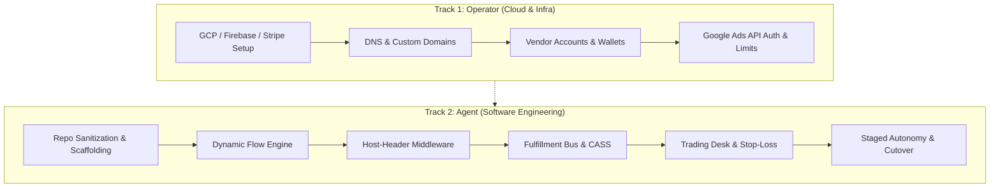

# Software Factory: Master Sprint Plan & Engineering Architecture

> **Purpose**: This document provides an exhaustive, multi-week engineering sprint plan for building the **v2 Micro-Commerce Software Factory**. It is designed to be fully portable and checked into the root of the new v2 repository.
> **Paradigm**: Systematic Quantitative Micro-Commerce (Parameterizing widgets, micro-targets, headless funnels, pluggable fulfillment, and capital allocation).

---

## Architecture & Executive Overview

The v2 platform abstracts the proven conversion loop of *Send My Notes / Aster & Blanche* into a **declarative, multi-tenant software factory**:
- **Strategy (Widget)**: Defined as code via `WidgetManifest`.
- **Micro-Target**: Programmatic landing routes with custom keywords, sentiment banks, and schema markup.
- **Conversion Terminal**: A headless `DynamicFlowEngine` (visual asset -> custom copy -> address -> 1-tap Apple Pay / Stripe Elements).
- **Physical Fulfillment Bus**: Pluggable vendor adapters (Handwrytten robotic pen, Printful on-demand goods, Lob sub-$1 direct mail).
- **Quant Trading Desk**: Systematic probe budgets ($20–$35), automated offline conversion sync (`gclid`), real-time contribution margin calculation, and automated stop-loss kill switches.

---

## Detailed Sprint Specifications

### Sprint 0: Foundation, Infra Provisioning & Clean Repository Clone
* **Target Duration**: Days 1–3
* **Primary Objective**: Stand up an isolated v2 cloud and repository environment without touching or disrupting the live v1 deployment.

#### 🧑‍💻 Operator Work (Your Responsibilities)
1. **GitHub Repository Provisioning**:
   - Create a new private repository (e.g., `github.com/zbrustkern/micro-commerce-factory`).
   - Clone or fork the current `sendmynotes` repository into the new remote.
2. **Google Cloud & Firebase Project Setup**:
   - Create a dedicated Google Cloud / Firebase project (e.g., `widget-factory-prod`).
   - Enable **Cloud Firestore** in Native Mode.
   - Enable **Firebase App Hosting** or **Google Cloud Run**.
   - Enable **Secret Manager API** in Google Cloud Console.
3. **Stripe Infrastructure**:
   - Generate a new Stripe Restricted API Key (`rk_live_...`) with permissions:
     - `Charges`: Write
     - `PaymentIntents`: Write
     - `Webhooks`: Write
   - Register a dedicated webhook endpoint: `https://<v2-domain>/api/webhooks/stripe`.
4. **Fulfillment Partner Sandboxes**:
   - Register a **Printful Developer Account** and create a test store to obtain test API keys.
   - Register a **Lob Developer Account** and obtain `test_` API keys.
5. **Runtime IAM Service Account**:
   - Generate a GCP service account key with `roles/secretmanager.secretAccessor` and `roles/datastore.user` to inject into App Hosting runtime.

#### 🤖 Agent Work (AI Engineering)
1. **Codebase Sanitization**:
   - Strip all hardcoded references to legacy project IDs and single-brand URLs.
   - Migrate environment references to dynamic configuration.
2. **Environment Schema Validator (`lib/env-validator.ts`)**:
   - Add Zod/TypeScript schemas validating new v2 credentials (`PRINTFUL_API_KEY`, `LOB_API_KEY`, `GOOGLE_ADS_DEVELOPER_TOKEN`).
3. **CI/CD Build Pipeline Configuration**:
   - Update `apphosting.yaml` and GitHub Actions workflow to enforce linting (`npm run lint`), type-checking (`npx tsc --noEmit`), and automated unit tests.
4. **Factory Directory Structure**:
   - Scaffold clean architectural boundaries:
     - `lib/factory/`: Manifest contracts and trading desk models.
     - `lib/fulfillment/`: Vendor adapters.
     - `components/funnel/`: Composable step primitives.
     - `config/brands/`: Brand theme tokens, colophons, and tracking IDs.

#### Acceptance Criteria & Verification
- `npm run build` passes with zero errors on the clean v2 repository.
- `lib/env-validator.ts` cleanly differentiates local development mocks from live production secrets.
- v1 deployment continues serving live customers without any dependency on v2.

---

### Sprint 1: Decoupling, Parameterization & Dynamic Flow Engine
* **Target Duration**: Week 1
* **Primary Objective**: Transform the hardcoded 4-step card builder into a headless, schema-driven "Universal Vending Machine".

#### 🧑‍💻 Operator Work
1. **Catalog Definition for Initial Tranches**:
   - Finalize target specifications for initial products:
     - **SKU 1**: Aster & Blanche A2 Letterpress Card (Handwrytten robotic pen). Retail: $9.00. COGS: $5.15. Target Contribution: $3.56.
     - **SKU 2**: Bespoke 8x10 Fine Art Giclée Print (Prodigi/Printful). Retail: $28.00. COGS: $6.50. Target Contribution: $19.50.
     - **SKU 3**: Commemorative Milestone Letter / Certificate (Lob). Retail: $12.00. COGS: $1.15. Target Contribution: $10.15.
2. **Pricing & Unit Economics Parameters**:
   - Review and sign off on default probe budgets ($25–$35) and break-even CPA ceilings.

#### 🤖 Agent Work
1. **Declarative Manifest Engine (`lib/factory/manifest.ts`)**:
   - Formalize the `WidgetManifest` parser with validation for step sequences, asset aspect ratios, and fulfillment routing.
2. **Step Component Extraction**:
   - Extract `components/CoverStep.tsx` $\rightarrow$ `components/funnel/VisualAssetStep.tsx` (supports AI prompt generation, preset catalog, and user image uploads).
   - Extract `components/InsideNoteStep.tsx` $\rightarrow$ `components/funnel/CustomTextStep.tsx` (supports note composition, sentiment shuffle, monograms, and inscriptions).
   - Extract `components/AddressStep.tsx` $\rightarrow$ `components/funnel/ShippingAddressStep.tsx` (native HTML5 autofill with standardized schema).
   - Extract `components/CheckoutStep.tsx` $\rightarrow$ `components/funnel/UniversalCheckoutStep.tsx` (Stripe Elements, Apple Pay, Google Pay).
3. **Dynamic Funnel Orchestrator (`components/funnel/DynamicFlowEngine.tsx`)**:
   - Build a state-machine step runner that consumes any valid `WidgetManifest` and renders the appropriate sequence of steps.
4. **Standardized Funnel Telemetry**:
   - Emit uniform telemetry events across all dynamic widgets (`step_viewed`, `step_completed`, `field_engaged`, `abandoned`).

#### Acceptance Criteria & Verification
- A developer can register a new widget simply by adding a single JSON/TypeScript manifest file—without authoring any new React page components.
- The dynamic flow successfully transitions through all configured steps and authorizes test payments via Stripe Elements.

---

### Sprint 2: Multi-Tenancy Middleware & Multi-Brand Theming
* **Target Duration**: Week 2
* **Primary Objective**: Serve multiple distinct brand storefronts and widget domains from a single deployed container.

#### 🧑‍💻 Operator Work
1. **DNS & Custom Domain Routing**:
   - Map custom domains / subdomains to Firebase App Hosting / Cloud Run (e.g., `sendmynotes.com`, `asterandblanche.com`, `art.widgetfactory.dev`).
   - Provision SSL certificates in Google Cloud.
2. **Brand Identity Assets**:
   - Provide logo SVGs, colophon press marks, and hex palette tokens for test brands.

#### 🤖 Agent Work
1. **Next.js Host Middleware (`middleware.ts`)**:
   - Intercept incoming request `Host` header.
   - Resolve matching `BrandConfig` from `config/brands/` or Firestore cache.
   - Rewrite request paths dynamically to inject tenant context (`/brands/[tenant]/...`).
2. **Dynamic Theme & Typography Injector**:
   - Inject brand CSS variables (primary colors, background hues, font families) into document `<head>` dynamically.
3. **Dynamic Colophon & Backplate Engine**:
   - Render brand-specific press marks, headquarters text, and packaging slip metadata per tenant.
4. **Brand-Isolated Tracking & Analytics**:
   - Route conversion events to the specific Google Ads Conversion ID and Meta Pixel configured for that brand.

#### Acceptance Criteria & Verification
- Pointing browser to `Domain A` renders Brand A's styling, logo, and cards.
- Pointing browser to `Domain B` renders Brand B's styling, logo, and products—with zero cross-contamination of cookies or pixels.

---

### Sprint 3: Pluggable Fulfillment Bus (Printful + Lob + Handwrytten)
* **Target Duration**: Week 3
* **Primary Objective**: Implement a pluggable fulfillment adapter bus supporting on-demand goods, sub-$1 direct mail, and robotic pens.

#### 🧑‍💻 Operator Work
1. **Vendor Wallet Funding**:
   - Add credit card to Printful Wallet and enable auto-fulfillment.
   - Fund Lob test account balance.
2. **Low-Balance Alerting**:
   - Configure email notification thresholds ($150–$200) for supplier wallets.

#### 🤖 Agent Work
1. **Fulfillment Adapter Contract (`lib/fulfillment/types.ts`)**:
   - Formalize standard interface: `submitOrder`, `checkOrderStatus`, `getBalance`, and `validateAddress`.
2. **Refactor Handwrytten Client**:
   - Wrap existing [lib/handwrytten.ts](file:///Users/zeke/code/sendmynotes/lib/handwrytten.ts) into `HandwryttenAdapter`.
3. **Printful Adapter (`lib/fulfillment/printful.ts`)**:
   - REST v2 client with sync/mock support for fine art prints, mugs, and apparel.
   - Webhook listener for `package_shipped` and `order_failed`.
4. **Lob Adapter (`lib/fulfillment/lob.ts`)**:
   - Programmatic 4x6 postcards and 1-page letters.
   - Integrated USPS CASS address verification.
5. **Pre-Flight Address Sanitizer**:
   - Run CASS hygiene prior to payment capture to eliminate postal carrier rejects.
6. **Automated Wallet Health Pingers & Quarantine Queue**:
   - Hourly cron checks balance on all configured suppliers. If balance drops below threshold, alert operator and quarantine new orders in `AWAITING_WALLET_FUNDS` state without dropping orders.

#### Acceptance Criteria & Verification
- Test orders for Handwrytten, Printful, and Lob all dispatch cleanly via unified `submitOrder()` interface.
- Invalid recipient addresses are caught and corrected before Stripe charge is captured.

---

### Sprint 4: Direct Ad Platform API Trading Desk (Google Ads API)
* **Target Duration**: Week 4
* **Primary Objective**: Direct programmatic integration with Google Ads for automated offline conversion uploads, probe budgeting, and stop-loss kill switches.

#### 🧑‍💻 Operator Work
1. **Google Ads Developer Access**:
   - Request basic Google Ads API Developer Token.
2. **GCP OAuth 2.0 Credentials**:
   - Create OAuth Web Application credentials in GCP Console with Google Ads API scopes (`https://www.googleapis.com/auth/adwords`).
3. **Generate Persistent Refresh Token**:
   - Execute OAuth consent flow to obtain refresh token for backend service.
4. **Account-Level Spend Caps**:
   - Set hard account-level monthly spend limit in Google Ads billing settings.

#### 🤖 Agent Work
1. **Google Ads API Client (`lib/trading/google-ads.ts`)**:
   - REST client for campaign, ad group, and conversion management.
2. **Offline Conversion Uploader**:
   - Programmatically uploads verified checkout data: sends `gclid`, conversion action ID, transaction value, and timestamp to Google Ads within 3 hours of order.
   - Powers Google Smart Bidding with real gross revenue instead of browser cookie proxies.
3. **Programmatic Probe Campaign Controller**:
   - Programmatically create/update Responsive Search Ads and Ad Groups for dynamic scenario slugs.
   - Enforce strict probe budget caps ($20–$35).
4. **Automated Stop-Loss Kill Switch**:
   - Hourly cron monitors campaign spend vs order conversions.
   - If spend exceeds $30 with 0 checkouts, automatically call `campaignService.mutate` to pause campaign and trigger operator alert.

#### Acceptance Criteria & Verification
- Verified purchases automatically sync offline conversions to Google Ads API with correct GCLIDs.
- Test probe campaign automatically pauses when simulated spend exceeds the stop-loss threshold.

---

### Sprint 5: Staged Autonomy & Final Cutover
* **Target Duration**: Week 5
* **Primary Objective**: Build the Operator staging interface, validate agentic product creation, and cleanly cut over production traffic.

#### 🧑‍💻 Operator Work
1. **Review Staged Campaigns**:
   - Test the 1-click launch workflow on 2 micro-targeted niches.
2. **Final Domain Cutover Approval**:
   - Authorize updating production DNS for `sendmynotes.com` to point to the v2 cluster.

#### 🤖 Agent Work
1. **Admin Trading Desk UI (`components/admin/TradingDesk.tsx`)**:
   - Dashboard displaying active "trades" (widget + campaign pairs).
   - Real-time PnL table: `Gross Revenue - Stripe Fees - COGS - Ad Spend = Net Contribution`.
   - 1-Click "Deploy Probe Campaign ($25)" staging button.
2. **Market Scout & Crafter Agent Subroutines**:
   - Background workflow that takes a keyword hypothesis, drafts a `WidgetManifest`, generates 300 DPI preview art via Gemini, and stages the landing route.
3. **Backwards Compatibility Suite**:
   - Run end-to-end regression tests ensuring all existing Aster & Blanche cards, fonts, and customer order history remain 100% functional on v2.
4. **Cutover Execution & Monitoring**:
   - Execute zero-downtime DNS cutover, verify webhook listeners, and monitor live telemetry.

#### Acceptance Criteria & Verification
- Operator can review a staged widget in the Admin Dashboard and launch an end-to-end ad campaign with a single click.
- Production traffic cutover completes with zero lost orders or broken webhooks.
